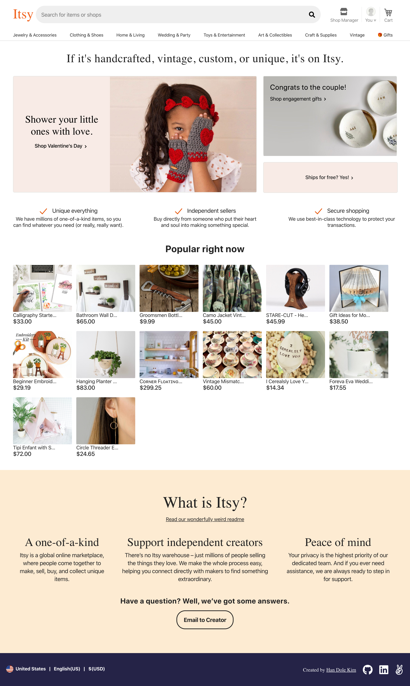
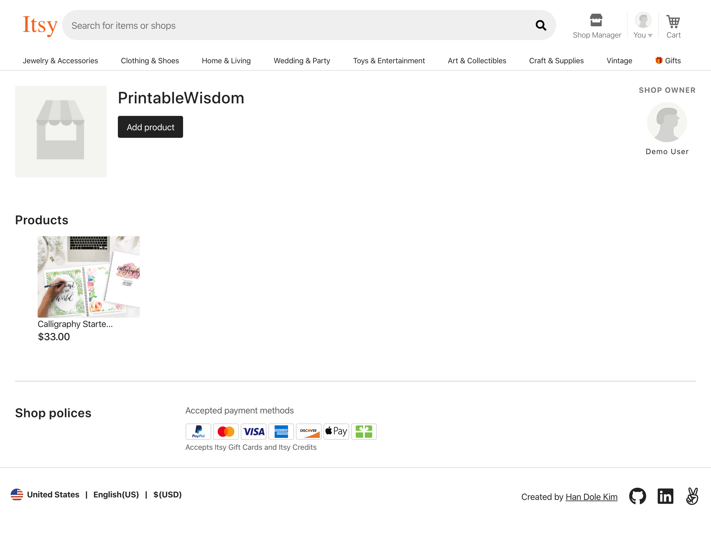
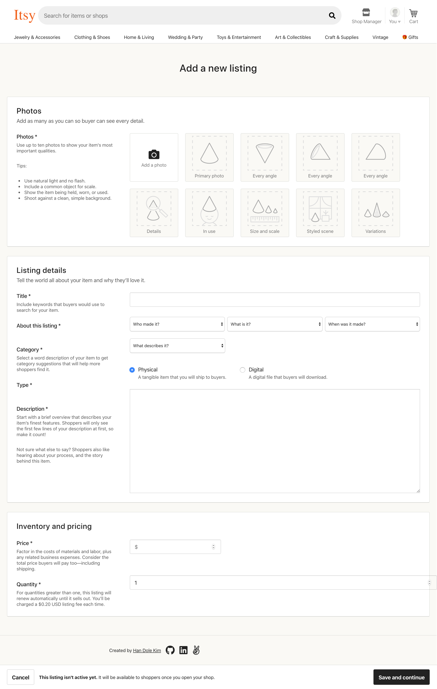
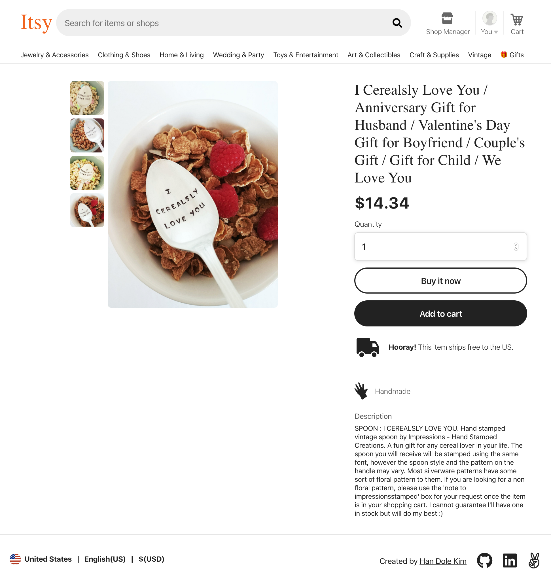
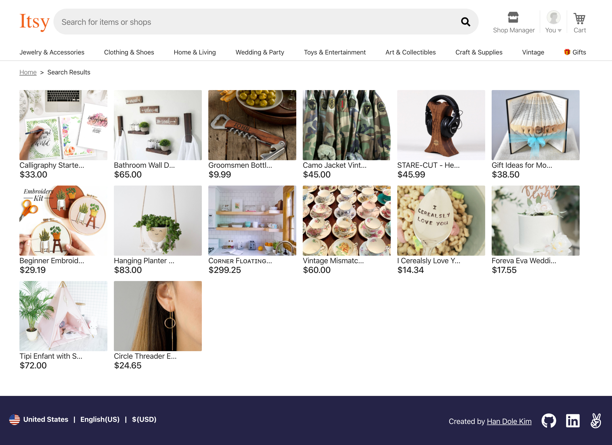
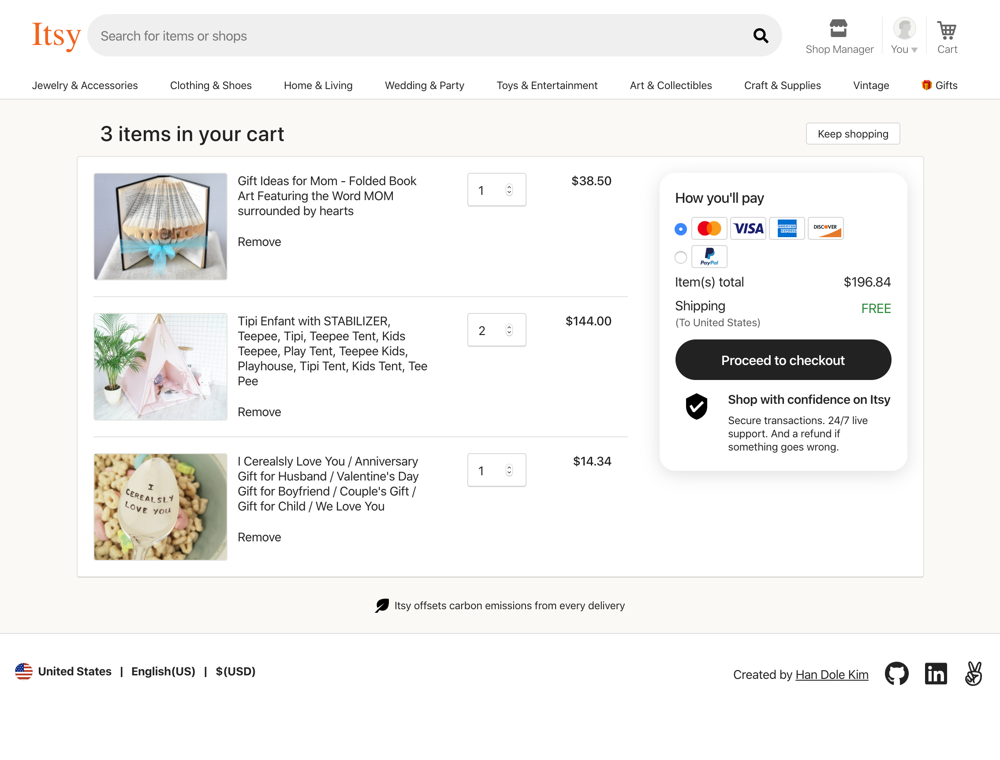

# README
## Itsy
[Itsy](https://etsycloneitsy.com), an Etsy clone, is a marketplace website focused on handmade or vintage items and craft supplies.


## Built with
* [React.js](https://reactjs.org/)
* [Redux.js](https://redux.js.org/)
* [JBuilder](https://github.com/rails/jbuilder)
* [Ruby on Rails](https://rubyonrails.org/)
* [PostgresSQL](https://www.postgresql.org/)
* [AWS](https://aws.amazon.com)

## Deployment
Hosted on [Heroku](https://www.heroku.com/)

## Getting started
Refer to the [wiki](https://github.com/kimhandole/itsy/wiki) for more details of Itsy!

## Installation
```
git clone https://github.com/kimhandole/itsy.git
cd itsy
bundle install
npm install
bundle exec rails s
npm run webpack
```

## Key features
### User Auth 
User can sign up or sign in to make create, edit, delete or see shops that belongs to the user. 

### Shop (CRUD)
Signed in user can create, edit, delete shops that can hold listings of products.



### Product 
Shop owner can add listings with multiple images to shops. Shops can have mulitple product listings.


### Product Show
User can see multiple images of the product and read details.



### Category
Product listings are visible by category selection. 

### Search
User can search by product listing title or shop name.



### Shopping Cart 
Signed in user can add products to their own shopping cart. Cart items can be added, edited, or deleted.



## Technical details
### Two different colored footer
Dark and white version footers
```
const Footer = ({isDark}) => {
    return (
        <footer className="footer" id={isDark ? "footer-dark" : ""}>
            ...
            <section className="footer-right" id={isDark ? "footer-white" : ""}>
                ...
            </section>
        </footer>
```

### Shop fetching
```
class ShopIndex extends Component {
    constructor(props) {
      super(props);
    }
    
    componentDidMount() {
        if (this.props.shops.length === 0) {
            this.props.fetchShops(this.props.currentUser);
        }
    }
    
    render() {
      ...
    }
```

#### Prevent fetching old data and update after new data has already updated on front-end 
* after create, edit or delete a shop, front-end fetched a updated shop to front-end, `fetchShop(shopId)`
* then it redirects to shop index page which triggers fetch all shops from database
* if database has not been updated with new data, above fetch, `fetchShops()` will re-update shop index page with old data
* if database has updated with new data, `fetchShops()` will re-update shop index page by replacing all shops object on front-end
* as a solution, shop index component will check if there were already fetched shops then triger `fetchShops()` only when it is needed, ex) first time visiting shop index page 
* as a result, shop index component avoids extra unnecessary fetching that could take a lot of time and compute if user has many shops, also less stress to the server and backend


### Loading
```
render() {
    if (!this.props.item) {
        return <LoadingIcon />
    }
    ...
}
```

## Author and Creator
[Han Dole Kim](https://handolekim.com/)